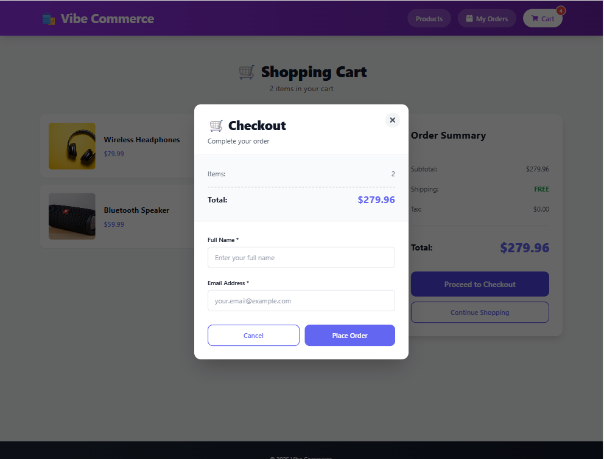

# 🛍️ Vibe Commerce - Shopping Cart


## 🎯 Overview

Vibe Commerce is a e-commerce shopping cart application that demonstrates modern web development practices. The application handles complete shopping cart workflows including product browsing, cart management, and checkout processing.

## ✨ Features

### Core Features
- ✅ **Product Catalog**: Browse 10 mock products with images, prices, and descriptions
- ✅ **Shopping Cart**: Add, remove, and update item quantities
- ✅ **Real-time Total**: Automatic calculation of cart totals
- ✅ **Checkout Process**: Customer information form with validation
- ✅ **Order Receipt**: Mock receipt generation with order details
- ✅ **Responsive Design**: Mobile-first, works on all screen sizes


## 🛠️ Tech Stack

### Frontend
- **React 18.2** - UI library
- **React Context API** - State management
- **Axios** - HTTP client
- **React Hot Toast** - Notifications
- **React Icons** - Icon library
- **CSS3** - Styling with CSS Grid & Flexbox

### Backend
- **Node.js** - Runtime environment
- **Express.js** - Web framework
- **MongoDB** - Database
- **CORS** - Cross-origin resource sharing

## 📁 Project Structure

```
Nexora/
├── backend/
│   ├── models/
│   │   ├── Product.js          # Product schema
│   │   ├── Cart.js             # Cart schema
│   │   └── Order.js            # Order schema
│   ├── routes/
│   │   ├── products.js         # Product routes
│   │   ├── cart.js             # Cart routes
│   │   └── checkout.js         # Checkout routes
│   ├── server.js               # Express server
│   ├── seed.js                 # Database seeding script
│   ├── package.json
│   ├── .env                    # Environment variables
│   └── .gitignore
│
├── frontend/
│   ├── public/
│   │   ├── index.html
│   │   └── manifest.json
│   ├── src/
│   │   ├── components/
│   │   │   ├── Header.js       # Navigation header
│   │   │   ├── Header.css
│   │   │   ├── ProductCard.js  # Product display card
│   │   │   ├── ProductCard.css
│   │   │   ├── CartItem.js     # Cart item component
│   │   │   ├── CartItem.css
│   │   │   ├── CheckoutModal.js # Checkout form
│   │   │   ├── CheckoutModal.css
│   │   │   ├── ReceiptModal.js  # Order receipt
│   │   │   └── ReceiptModal.css
│   │   ├── pages/
│   │   │   ├── ProductList.js  # Products page
│   │   │   ├── ProductList.css
│   │   │   ├── Cart.js         # Cart page
│   │   │   └── Cart.css
│   │   ├── context/
│   │   │   └── CartContext.js  # Cart state management
│   │   ├── services/
│   │   │   └── api.js          # API service layer
│   │   ├── App.js              # Main app component
│   │   ├── App.css
│   │   ├── index.js            # Entry point
│   │   └── index.css           # Global styles
│   ├── package.json
│   ├── .env
│   └── .gitignore
│
└── README.md                   # This file
```

## 🚀 Setup Instructions

### Prerequisites
- Node.js (v14 or higher)
- MongoDB (v4.4 or higher)
- npm or yarn
- Git

### Step 1: Clone the Repository
```bash
git clone <your-repo-url>
cd Nexora
```

### Step 2: Setup Backend

1. Navigate to backend directory:
```bash
cd backend
```

2. Install dependencies:
```bash
npm install
```

3. Configure environment variables:
   - The `.env` file is already created with default values
   - Update `MONGODB_URI` if using a different MongoDB connection
   ```
   PORT=5000
   MONGODB_URI=mongodb://localhost:27017/vibe-commerce
   NODE_ENV=development
   ```

4. Ensure MongoDB is running:
```bash
# On Windows (if MongoDB is installed as a service)
net start MongoDB

# On macOS/Linux
mongod
```

5. Seed the database with products:
```bash
npm run seed
```

6. Start the backend server:
```bash
npm run dev
```

Backend should now be running on `http://localhost:5000`

### Step 3: Setup Frontend

1. Open a new terminal and navigate to frontend directory:
```bash
cd frontend
```

2. Install dependencies:
```bash
npm install
```

3. Start the development server:
```bash
npm start
```

Frontend should now be running on `http://localhost:3000`


## 📸 Screenshots

### Home Page - Product Grid

*Responsive product grid with add to cart functionality*

### Shopping Cart

*Cart view with quantity controls and order summary*

### Checkout Modal

*Customer information form with validation*

### Order Receipt

*Order confirmation with receipt details*

### Mobile Responsive

*Fully responsive design for mobile devices*


## 🎥 Demo Video

**[Watch Demo Video](your-loom-or-youtube-link-here)**


### Test the API with cURL

```bash
# Get all products
curl http://localhost:5000/api/products

# Add to cart
curl -X POST http://localhost:5000/api/cart \
  -H "Content-Type: application/json" \
  -d '{"productId":"PRODUCT_ID","quantity":1}'

# Get cart
curl http://localhost:5000/api/cart

# Checkout
curl -X POST http://localhost:5000/api/checkout \
  -H "Content-Type: application/json" \
  -d '{"customerName":"Test User","customerEmail":"test@example.com"}'
```

